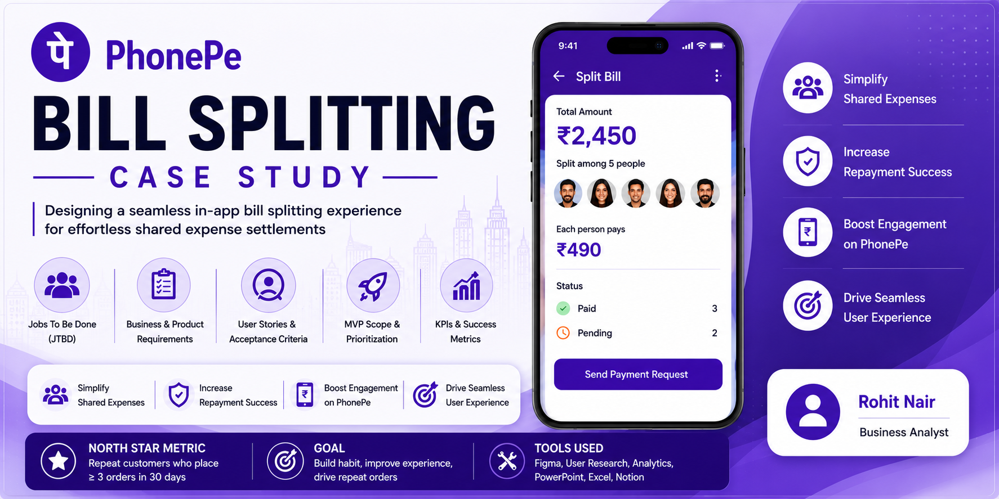

# 📱 PhonePe Bill Splitting Case Study

## 📌 Project Overview
This Business Analysis case study proposes a Bill Splitting feature for PhonePe that simplifies shared expense management. The solution enables users to split bills, request repayments, and track settlements directly within the PhonePe ecosystem.

---

## 🎯 Problem Statement

Urban PhonePe users currently rely on multiple apps to calculate and manage shared expenses such as rent, utilities, dining, and travel. This fragmented experience causes:

- Manual calculations
- Poor repayment tracking
- Delayed settlements
- Frequent follow-ups

The objective is to create a seamless in-app Bill Splitting experience that improves user convenience and increases successful repayment transactions.

---

## 🎯 Business Objectives

- Simplify shared expense settlements
- Reduce manual effort
- Increase repayment completion rate
- Improve user experience
- Increase engagement within the PhonePe ecosystem

---

## 👥 Stakeholders

- Product Team
- Engineering Team
- Design Team
- Compliance Team

---

## 🧩 Framework Used

- Jobs To Be Done (JTBD)
- Business Requirements
- Product Requirements
- User Stories
- Acceptance Criteria
- MoSCoW Prioritization
- MVP Planning
- Risk Assessment
- KPI Framework

---

## 📋 Business Requirements

- Simplify group settlements
- Improve repayment transparency
- Increase successful group repayments

---

## 📑 Product Requirements

- Create Bill Split
- Add Members
- Automatic Share Calculation
- Send Payment Requests
- Track Repayment Status
- Outstanding Balance Tracking
- Reminder Notifications

---

## 👤 User Stories

### Collector

- Create bill split
- Auto-calculate member shares
- Send payment requests

### Member

- Receive repayment request
- View amount owed
- Complete payment easily

### Tracking

- View Paid/Pending status
- Monitor outstanding balances

---

## 🚀 MVP Scope

### Must Have

- Bill Split Creation
- Member Addition
- Auto Share Calculation
- Payment Requests
- Repayment Tracking
- Outstanding Balance

### Should Have

- Payment Reminders
- Push Notifications

### Could Have

- Partial Payments

### Won't Have (V1)

- Expense Analytics
- Recurring Group Templates

---

## 📊 Success Metrics (KPIs)

- Bill Split Adoption Rate
- Monthly Active Bill Split Users
- Settlement Completion Rate
- Average Settlement Time
- Repayment Success Rate

---

## ⚠️ Risks

- UPI transaction limits
- Compliance delays
- Low feature adoption

---

## 🔗 Dependencies

- UPI Infrastructure
- Notification Services
- Regulatory Compliance
- Backend Ledger System

---

## 🛠️ Skills Demonstrated

- Business Analysis
- Product Thinking
- Requirement Gathering
- Stakeholder Management
- JTBD
- Product Requirements
- MVP Planning
- KPI Design
- Risk Analysis

---

## 📄 Project Deliverable

- PhonePe_Case_Study.pdf

---

## 👤 Author

**Rohit Nair**

Aspiring Business Analyst | Product Thinking | Business Analysis | AI | Product Strategy
